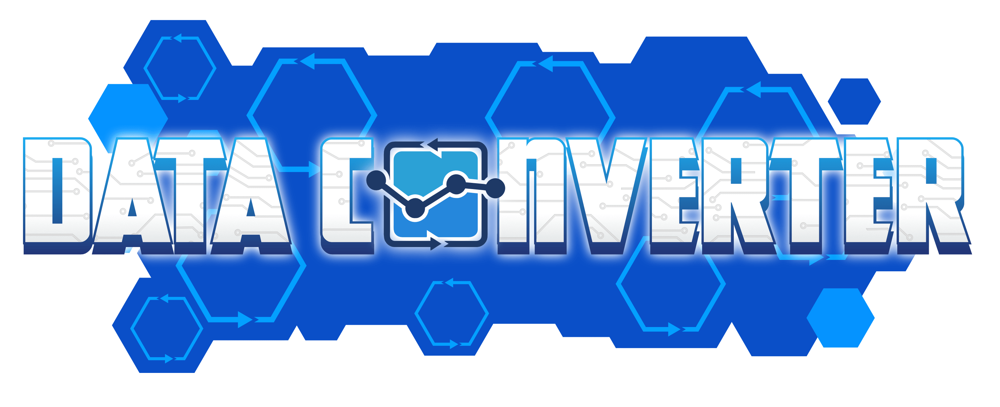

# Data-Converter 
[](https://opensource.org/licenses/Apache-2.0)



This is the repository for Data Converter, an application for converting EDI files formats (such as PDF and CSV) from a source format to a target format which can be read by a company's existing systems. These conversions from a source file to a target file need to be analyzed and written by a programmer, but once the transition is written, it creates a highly realiable interface where all an operator needs to do is drag and drop a file into the application in order to do the coversion. 

## Installation

- Install Nodejs
- Install Redis
- Install MariaDB

### Debian / Ubuntu

```
$ curl -fsSL https://deb.nodesource.com/setup_16.x | sudo -E bash -
$ sudo apt-get install -y git
$ sudo apt-get install -y nodejs
$ sudo apt-get install -y redis
$ sudo apt-get install -y mariadb-server
```

## How to Clone and Get Started

- git clone
- npm install
- create database
- create database user
- setup schema for database
- create first user

### Debian / Ubuntu

```
$ git clone https://github.com/WebServiceDevelopment/Data-Converter.git
$ cd Data-Converter
$ npm i
$ sudo mysql
> CREATE DATABASE 'data-converter';
> CREATE USER 'admin'@'localhost' IDENTIFIED BY 'keyboardcat';
> GRANT ALL ON 'data-converter'.* TO 'admin'@'localhost';
> FLUSH PRIVILEGES;
> exit
$ cd model
$ sudo mysql data-converter < wsd_data_converter_schema.sql
$ cd ../
$ node index.js
```


## Concept


## Copyright

Copyright Web Service Development Inc. 2020 - 2022 Apache 2.0 License
